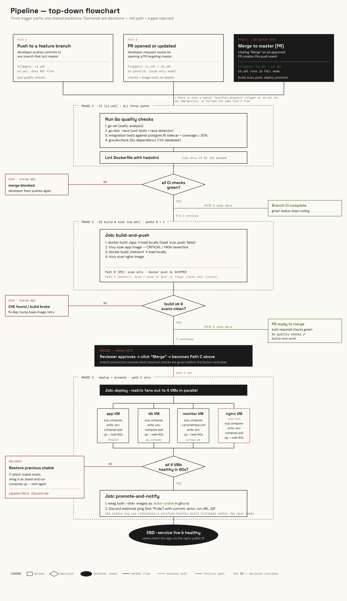

# CI/CD Pipeline



Two workflow files run automatically on every push.

---

## ci.yml — Quality gates (all branches + PRs)

Runs on every push to any branch and on every pull request.

| Step | Tool | Purpose |
|---|---|---|
| Static analysis | `go vet` | Catches common Go bugs (misused format strings, unreachable code, etc.) |
| Tests + race detector | `go test -race` | Runs all unit tests and detects data races |
| Coverage threshold | `go tool cover` | Fails if total test coverage drops below 80% |
| Vulnerability scan | `govulncheck` | Checks Go dependencies against the Go vulnerability database |
| Dockerfile lint | `hadolint` | Enforces Dockerfile best practices |

This workflow is the quality gate for pull requests. It must be configured as a **required status check** on `master` via branch protection rules so that cd.yml can rely on it having passed.

---

## cd.yml — Build, scan, and deploy

Runs on every push to `master`, on every pull request targeting `master`, and can be triggered manually via `workflow_dispatch`.

On **pull requests**, only `build-and-push` runs — the image is built and scanned for CVEs, but nothing is pushed to GHCR and no deploy happens. This catches Dockerfile errors and critical vulnerabilities before merge.

On **push to master**, the full pipeline runs. A concurrency lock prevents two deploys from racing.

```
build-and-push → deploy → promote-and-notify
```

### build-and-push
1. Builds the **app** image (`./app`) and **nginx** image (`./network`) locally (not yet pushed to the registry).
2. Scans both images with **Trivy** for `CRITICAL` and `HIGH` CVEs. The pipeline stops if any unfixed vulnerabilities are found.
3. Pushes both images to GHCR with two tags each: `:latest` and `:<commit-sha>`.

### deploy
Deploys to four VMs in parallel using a matrix — one per service:

| VM | Compose file | Custom image | Proxy |
|---|---|---|---|
| app | `app/docker-compose.yaml` | `legacyproject` | via network VM |
| database | `database/docker-compose.yaml` | none (postgres:16) | via network VM |
| monitoring | `monitoring/docker-compose.yaml` + `prometheus.yml` | none | via network VM |
| network | `network/docker-compose.yaml` | `legacyproject-nginx` | direct (public IP) |

For each VM:
1. Copies the service's `docker-compose.yaml` to `~/legacyProject/<service>/` via SCP. The monitoring VM also receives `prometheus.yml`.
2. Assembles `~/legacyProject/<service>/.env` from individual secrets (`DB_HOST`, `DB_USER`, `DB_PASSWORD`, etc.) using `printf` — never echoed to logs.
3. Pulls the new image and runs `docker compose up --wait`, blocking until all healthchecks pass within 60 seconds.
4. On failure, rolls back to `:<image>:latest-stable` (the last confirmed-healthy image) for services with a custom image.

App, database, and monitoring VMs have no public IP and are reached via the network VM as a jump host (`SSH_PROXY_HOST`).

### promote-and-notify
Runs once after all four VMs are confirmed healthy.

1. Promotes both `legacyproject` and `legacyproject-nginx` to `:latest-stable` — a known-good reference that is never pushed speculatively.
2. Sends a Discord notification with the deploy status (requires the `DISCORD_WEBHOOK_URL` secret; silently skipped if not set).

---

## Secrets required

| Secret | Used by |
|---|---|
| `GITHUB_TOKEN` | GHCR login (provided automatically by GitHub Actions) |
| `SSH_HOST_APP` | SSH target for the app VM |
| `SSH_HOST_POSTGRES` | SSH target for the database VM |
| `SSH_HOST_MONITORING` | SSH target for the monitoring VM |
| `SSH_HOST_NGINX` | SSH target for the network/nginx VM (public IP) |
| `SSH_PROXY_HOST` | Jump host for reaching VMs without a public IP (the nginx VM's IP) |
| `VM_USER` | SSH username for all VMs |
| `AZURE_KEY` | SSH private key for all VMs |
| `DB_HOST` | Database hostname — written to `.env` on app and database VMs |
| `DB_PORT` | Database port |
| `DB_USER` | Database username (also used as `POSTGRES_USER`) |
| `DB_PASSWORD` | Database password (also used as `POSTGRES_PASSWORD`) |
| `DB_NAME` | Database name (also used as `POSTGRES_DB`) |
| `GRAFANA_PASSWORD` | Grafana admin password (`GF_SECURITY_ADMIN_PASSWORD`) |
| `APP_PRIVATE_IP` | Private IP of the app VM — written as `APP_HOST` in the nginx `.env` |
| `SSH_HOST_NGINX_PRIVATE` | Private IP of the nginx VM — used to render `prometheus.yml` scrape targets before copying to the monitoring VM |
| `DISCORD_WEBHOOK_URL` | Deploy notifications (optional) |

---

## Action version pinning

`actions/checkout` and `docker/login-action` are pinned to exact commit SHAs.
The remaining actions have `# TODO: pin to commit SHA` comments with instructions.
To get the SHA for any action tag, run:

```bash
gh api repos/<owner>/<repo>/git/ref/tags/<tag> --jq .object.sha
```
