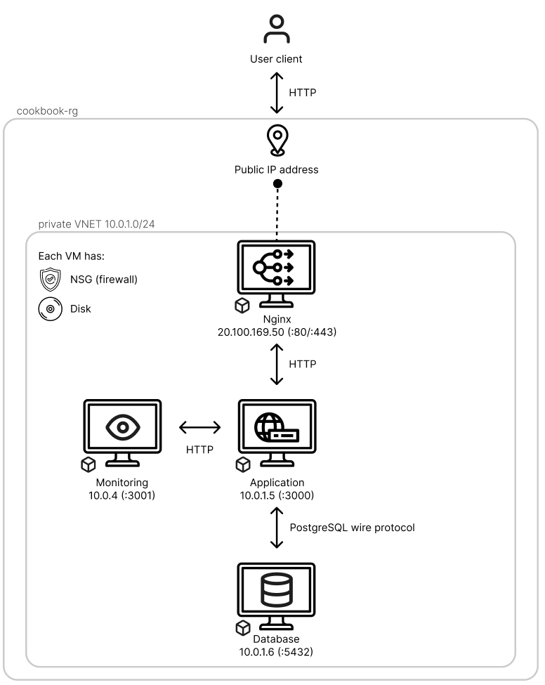

# Legacy Project

[](https://github.com/DenDanskeMetode/legacyProject/actions/workflows/ci.yml)
[](https://github.com/DenDanskeMetode/legacyProject/actions/workflows/cd.yml)
[](https://go.dev)
[](https://github.com/DenDanskeMetode/legacyProject/actions/workflows/ci.yml)
[](https://github.com/DenDanskeMetode/legacyProject/pkgs/container/legacyproject)

A Go rewrite of a legacy Python/Flask recipe cookbook application. The project serves both an HTML frontend and a JSON REST API, backed by PostgreSQL and deployed across four Azure VMs.

---

## Table of Contents

- [Tech Stack & Framework Choice](#tech-stack--framework-choice)
- [Architecture](#architecture)
- [Branching Strategy](#branching-strategy)
- [Running Locally](#running-locally)
- [Environment Variables](#environment-variables)
- [Database Schema](#database-schema)
- [Infrastructure](#infrastructure)
- [CI/CD](#cicd)
- [Monitoring](#monitoring)
- [Service Level Agreement](#service-level-agreement)
- [Branch Protection](#branch-protection-master)
- [Developer Setup (Git Hooks)](#developer-setup-git-hooks)
- [Definition of Done](#definition-of-done)

---

## Tech Stack & Framework Choice

| Layer | Technology |
|---|---|
| Language | Go 1.26.3 |
| HTTP | `net/http` (standard library) |
| Database | PostgreSQL 16 |
| Reverse proxy | Nginx |
| Monitoring | Prometheus + Grafana |
| Container registry | GHCR |
| Cloud | Azure (4 × Standard_B1s VMs) |

Go with `net/http` was chosen over the legacy Python/Flask stack for its performance and simplicity — it is compiled, statically typed, and the standard library HTTP server requires no external framework dependencies.

---

## Architecture

The application is split across four Azure VMs in a shared private VNet (`10.0.1.0/24`). Only the nginx VM has a public IP.



- The app VM and postgres VM are reachable only within the VNet — no public IP.
- The monitoring VM is also private; Grafana is exposed through nginx at `/grafana/`.
- All VMs are provisioned and configured by the IaC scripts in [`infrastructure/`](infrastructure/README.md).

---

## Branching Strategy

This project uses **GitHub Flow**:

1. Create a short-lived feature branch from `master` (e.g. `fix-healthcheck`, `add-monitoring`)
2. Open a Pull Request targeting `master`
3. CI must pass (`Go quality checks` + `build-and-push`) before merge
4. Merge to `master` triggers automatic deployment to production
5. Delete the feature branch after merge

Branch protection rules on `master` enforce that no direct pushes are allowed and all status checks must pass. See [Branch Protection](#branch-protection-master) for details.

---

## Running Locally

**Prerequisites:** Docker, Docker Compose, and a running PostgreSQL instance (or use the database compose file).

**1. Start the database**
```bash
cd database
cp .env.example .env   # fill in credentials
docker compose up -d
```

**2. Start the application**
```bash
cd app
cp .env.example .env   # fill in DB credentials to match step 1
docker compose up -d
```

The app is now available at `http://localhost:3000`.
Swagger UI is at `http://localhost:3000/swagger`.
Prometheus metrics are at `http://localhost:3000/metrics`.

**3. (Optional) Start monitoring**
```bash
cd monitoring
cp .env.example .env
docker compose up -d
```

Grafana is available at `http://localhost:3001`.

---

## Environment Variables

The following variables must be set for the application to run. In production they are written to `.env` on each VM by the CD pipeline from GitHub Secrets.

| Variable | Description |
|---|---|
| `DB_HOST` | PostgreSQL hostname |
| `DB_PORT` | PostgreSQL port (typically `5432`) |
| `DB_USER` | Database user |
| `DB_PASSWORD` | Database password |
| `DB_NAME` | Database name |

See each service's `.env.example` for the full list including monitoring and nginx variables.

---

## Database Schema

The schema is applied automatically on startup by `initDB()` in [`app/db.go`](app/db.go). No manual migrations are required.

| Table | Description |
|---|---|
| `users` | Registered users (`id`, `email`, `password`, `name`) |
| `recipes` | Recipe entries (`id`, `title`, `time_minutes`, `price`, `link`, `description`, `image`) |
| `ingredients` | Ingredient definitions (`id`, `name`) |
| `tags` | Tag definitions (`id`, `name`) |
| `recipe_ingredients` | Many-to-many join: recipe ↔ ingredient, with `amount` and `unit` |
| `recipe_tags` | Many-to-many join: recipe ↔ tag |

The database is seeded with four sample recipes on first startup if the `recipes` table is empty.

---

## Infrastructure

Infrastructure is managed as code using bash scripts in [`infrastructure/`](infrastructure/README.md).

- **`azure-setup.sh`** — provisions all four VMs, configures networking and firewall rules, installs Docker, and writes all GitHub Actions secrets automatically.
- **`azure-teardown.sh`** — deletes the entire resource group and all associated resources.

Every group member should be able to run the full setup → deploy → teardown cycle independently. See [`infrastructure/README.md`](infrastructure/README.md) for prerequisites and usage.

---

## CI/CD

Two GitHub Actions workflows run on every push:

| Workflow | Trigger | Purpose |
|---|---|---|
| [`ci.yml`](.github/workflows/ci.yml) | Every push + PR | `go vet`, unit tests, integration tests, ≥80% coverage, `govulncheck`, `hadolint` |
| [`cd.yml`](.github/workflows/cd.yml) | Push to `master` + PR to `master` | Build images, Trivy CVE scan, push to GHCR, deploy to all four VMs, rollback on failure, Discord notification |


On pull requests, `cd.yml` builds and scans the image but does not deploy. Full deployment only happens on merge to `master`.

**Deployment strategy — immutable rolling with automatic rollback:**
Every deploy tags the image with both `:latest` and `:<commit-sha>`. The pipeline blocks on health checks for all four VMs before promoting the image to `:latest-stable`. If any VM fails its health check within 60 seconds, that VM is rolled back to `:latest-stable` — the last confirmed-healthy build. The `:latest-stable` tag is never pushed speculatively, so rollback is always available.

See [`.github/workflows/README.md`](.github/workflows/README.md) for a detailed breakdown of every step.

---

## Monitoring

Prometheus scrapes metrics from the app every 15 seconds. Grafana visualises them.

| Environment | Prometheus | Grafana |
|---|---|---|
| Local | `http://localhost:9090` | `http://localhost:3001` |
| Production | internal only | `http://<nginx-public-ip>/grafana/` — IP is the value of the `SSH_HOST_NGINX` secret, set by `azure-setup.sh` |

Metrics exposed at `/metrics`:

| Metric | Type | What it tracks |
|---|---|---|
| `http_requests_total` | Counter | Request volume per endpoint and status code |
| `http_request_duration_seconds` | Histogram | Request latency per endpoint |
| `db_query_duration_seconds` | Histogram | Database operation performance per query type |

System metrics (CPU, memory, disk, network) are collected from all VMs via `node_exporter` running on port 9100.

### Grafana Alerting

Alert rules are not provisioned automatically — they must be configured manually in the Grafana UI after the first deployment. To satisfy the SLA, configure the following alerts:

| Alert | Condition | Purpose |
|---|---|---|
| App down | `up{job="ultimate-bravery-cookbook"} == 0` for > 1 min | Detect app or VM outage |
| High latency | `histogram_quantile(0.95, http_request_duration_seconds) > 2` | Detect SLA breach (2 s response time) |
| High error rate | `rate(http_requests_total{status=~"5.."}[5m]) > 0.05` | Detect elevated 5xx errors |
| Node down | `up{job="node_exporter"} == 0` for > 1 min | Detect VM-level failure |

Set the **evaluation interval** to 1 minute and configure a **contact point** (e-mail or webhook) under Grafana → Alerting → Contact points so that notifications are delivered within the 30-minute detection window defined in the SLA.

---

## Service Level Agreement

| Goal | Value |
|---|---|
| Uptime | ≥ 99% (max. ~7 hours downtime over 30 days) |
| Max. response time | 2 seconds for all endpoints under normal load |
| Downtime detection | Within 30 minutes via Grafana alerting |

Response time is measured via `http_request_duration_seconds` in Grafana. In case of unplanned downtime, the target is to detect and respond within 30 minutes.

---

## Branch Protection (master)

A GitHub Ruleset is configured on `master` with the following rules:

- **Restrict deletions** — the branch cannot be deleted
- **Require a pull request before merging** — no direct pushes; all changes must go through a PR
- **Require status checks to pass** — `Go quality checks` (ci.yml) and `build-and-push` (cd.yml) must pass before a PR can be merged; branches must also be up to date with master
- **Block force pushes** — history on master cannot be rewritten

No bypass list is configured, so these rules apply to everyone including admins.

---

## Developer Setup (Git Hooks)

All developers must install the pre-commit hooks once after cloning or pulling this setup. Hooks run linting and unit tests automatically on every `git commit`, catching issues before they reach CI.

### Prerequisites

Install the following tools on your development machine (one-time per machine):

**golangci-lint** (Go linter):
```bash
go install github.com/golangci/golangci-lint/cmd/golangci-lint@latest
```

**lefthook** (hook manager):
```bash
go install github.com/evilmartians/lefthook@latest
```

If the commands are not found after installing, ensure `%GOPATH%\bin` is on your `PATH`. Run `go env GOPATH` in PowerShell to find the path.

### Activate Hooks (run once per clone)

```bash
lefthook install
```

This writes hook scripts into `.git/hooks/` based on `lefthook.yml`.

### What Runs on Every Commit

Both checks run in parallel when any `app/**/*.go` file is staged. Commits that only touch Markdown, YAML, Docker files, etc. skip the hooks entirely.

| Check | Command | Notes |
|-------|---------|-------|
| Lint | `golangci-lint run ./...` | Runs govet, errcheck, staticcheck, gofmt, and more |
| Unit tests | `go test -race ./...` | Integration tests excluded — no DB required |

### Running Checks Manually

Run these from the `app/` directory:

| Command | What it does |
|---------|-------------|
| `golangci-lint run ./...` | Run golangci-lint |
| `go vet ./...` | Run go vet only |
| `go test -race ./...` | Run unit tests |
| `go test -race -tags integration -coverprofile=coverage.out ./...` | Run unit + integration tests (needs DB env vars) |

### Bypassing Hooks (use sparingly)

```bash
git commit --no-verify -m "your message"
```

Only use this for WIP commits on a personal branch. All code must pass checks before merging to master.

---

## Definition of Done

### 1. Code Quality & Standards
- **Peer Reviewed:** At least one peer has reviewed and approved the Pull Request (PR) on important changes.
- **Linting & Style:** Code passes all static analysis and linting checks with zero critical warnings.
- **No Technical Debt:** No temporary workarounds or "TODO" comments are introduced unless tracked in the backlog.

### 2. Testing Automation
- **Unit Tests:** Minimum test coverage threshold is met (80%+), and all tests pass.
- **Integration Tests:** API endpoints and component interactions are validated automatically in the pipeline.
- **Security Scanning (DevSecOps):** Static Application Security Testing (SAST) and dependency vulnerability scans run with zero "High" or "Critical" vulnerabilities.

### 3. Continuous Integration & Deployment (CI/CD)
- **Green Build:** The CI pipeline builds the artifact/container successfully without manual intervention.
- **Automated Deployment:** The artifact is automatically deployed.
- **Environment Parity:** The deployment uses the exact same configuration templates and scripts that will be used for production.

### 4. Observability & Operations
- **Telemetry:** Logging, metrics, and distributed tracing are implemented following architectural standards.

### 5. Product & Compliance
- **Documentation:** User-facing documentation, API specs (e.g., Swagger/OpenAPI), and internal architecture diagrams are updated.
